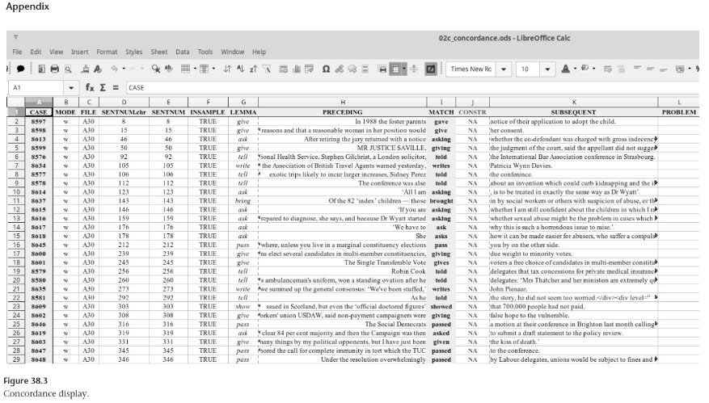
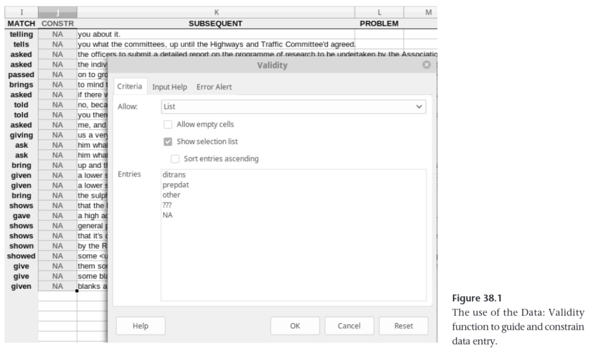
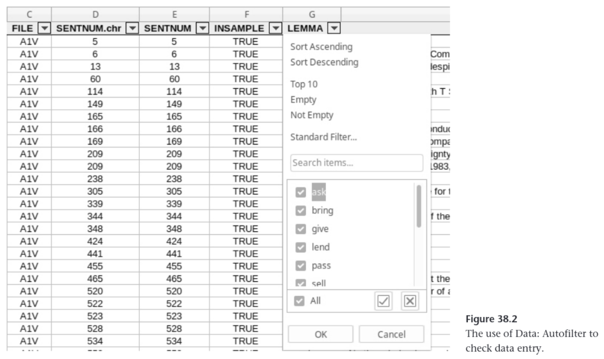

# 38 Managing Synchronic Corpus Data with the British National Corpus (BNC)

+ Class: Linguistics and Data Science
+ Presenter: Sumin Park
+ Date: 2023-10-30


## Table of content

1. Introduction
2. Retrieval
3. Annotation
4. Preparation and documentation

## Section 1. Introduction

### Data

British National Corpus World XML edition (BNC)

+ Consists of 4,049 files with 10 million words from spoken and 90 million words from written data
+ Represents British English of the 1980s

(HINT: YOU CAN PROVIDE WITH MORE INFORMATION ABOUT BNC)

### Research topic

English dative alternation between (i) a ditransitive construction and (ii) the often-available prepositional dative to _to_.

Examples:

1. Captain Picard **gave** [Commander Data] [a new phaser]. (ditransitive)
2. Captain Picard **gave** [a new phaser] *to* [Commander Data]. (prepositional)

### A corpus-linguistic analysis begins from...

**Concordance display** showing instances of each construction in context

(HINT: YOU MAY WANT TO ADD WHAT A CONCORDANCE DISPLAY IS HERE)

#### Figure 38.3



### Three Steps for corpus-linguistic search process

1. Running a query/search based on much existing annotation.
2. Preparing the concordance lines for annotation.
3. Doing some final cheking and preparatory steps for the following statistical analysis.

(HINT: A PROPER NUMBERING MATTERS)

#### Step 1: Running a query/search based on much existing annotation

Query/search: Words/lemmas and parts of speech.

Ten verb lemmas selected:

+ Four verb lemmas that strongly prefer the ditransitve: *tell*, *give*, *show*, and *ask*.
+ Three verb lemmas that strongly prefer the prepositional dative: *bring*, *sell*, and *pass*.
+ Three verb lemmas that are relatively neutral with regard to the two constructions: *send*, *lend*, and *write*.

#### Step 2: Preparing the concordance lines for two kinds of annotation

1. To identify the hits that involve the verbs but not the constructions in question.
2. To annotate each constructional use for the linguistic/contextual variables whose effect on the dative alternation is to be studied.

#### Step 3: Doing some final cheking and preparatory steps for the following statistical analysis

(HINT: SUCH A STATISTICAL ANALYSIS IS OUT OF TOPIC HERE)

## Section 2. Retrieval

### First step of data management

Extracting a first version of the concordance lines **from the BNC**.

(HINT: WHAT DOES THE BNC ANNOTATION LOOK LIKE? SEE THE FOLLOWING EXAMPLE)

#### Example 38.1

Two one-sentence utterances from the BNC World edition, file D8Y.xml.

```xml
<!-- Utterance (speaker id: D8YPS006) -->
<u who="D8YPS006">
    <!-- Sentence (sentence number: 80) -->
    <s n="80">
        <!-- Word "And" (POS tag: CONJ-CJC, Head word: and) -->
        <w c5="CJC" hw="and" pos="CONJ">
            And 
        </w>
        <!-- Word "erm" (POS tag: UNC-UNC, Head word: erm) -->
        <w c5="UNC" hw="erm" POS="UNC">
            erm 
        </w>
        <!-- Pause -->
        <pause/>
        ...
        <!-- Punctuation "." -->
        <c c5="PUN">
            .
        </c>
    </s>
</u>
```
(HINT: ADD AS MANY COMMENTS AS POSSIBLE TO THE XML FILE ABOVE)

### Task

Creating a concordance of the ten above-mentioned verb lemmas from all of the BNC.

(HINT: THE AUTHOR USES THE R LANGUAGE HERE, THEN YOU DON'T NEED TO DETAIL THE ALGORITHM HERE)

#### Requirement

Each use of the given ten verbs is in its own row, as in Table 38.1

#### Table 38.1

The case-by-variable format for two matches in one sentence

|Preceding|Match|Subsequent|
|-|-|-|
|Picard|showed|Data a phaser then Data showed it to Riker |
|Picard showed Data a phaser and then Data | showed | it to Riker |

+ The sentence *"Picard showed Data a phaser and then Data showed it to Riker"* contains two matches for *showed*, so each of the both is represented as an independent row.
+ **Preceding**: the preceding context of each *showed*.
+ **Match**: the use of each *showed*.
+ **Subsequent**: the following context of each *showed*.

(HINT: THE PRECEDING/SUBSEQUENT CONTEXTS MUST BE PROVIDED FOR A FUTURE STUDY)

#### Final product

Save the concordance data as a CSV file.


## Section 3. Annotation

### Second steps to data manangement

1. Preparing to weed out false positives.
2. Adding annotation with regard to the variables that might affect the dative alternation to the true positives.

(HINT: IF YOU ARE NOT FAMILIAR TO TRUE/FALSE POSITIVE/NEGATIVES, RESEARCH AND EXPLAIN HERE)

### Tasks

1. Adding additional columns to the data

   + **Construction**: a column that will contain the labels *ditrans*/*prepdat*/*other*.
   + **Problem**: a column that will contain the letter of the column that contain something problematic.
     + Don't change the color of the problematic cell!
  
2. Selecting a sample of concordance lines

    + Don't draw random sample of lines.
    + Do draw random sample of files. (HINT: WHY?)
      + Set a random-number seed for replicability!

3. Annotating actually (i) whether concordance lines are the right construction(s) and (ii) what their characteristics are that might have affected the speaker's choice
    
    + Use a spreadsheet software such as LibreOffice Calc.

#### Figure 38.1

The use of the [Data: Validity] function to guide and constrain data entry.



## Section 4. Preparation and documentation

### Third step to data manangement

Making sure the data are in good shape for subsequent analysis

### Task

Performing a general sanity check of the data as a whole but specifically the annotation that was entered.

#### Figure 38.2

The use of the [Data: Autofilter] to check data entry.



### Another task

Naming files and documenting workflow across files.